<script>
    $(document).ready(function() {
      $items = $('div#TOC li');
      $items.each(function(idx) {
        num_ul = $(this).parentsUntil('#TOC').length;
        $(this).css({'text-indent': num_ul * 10, 'padding-left': 0, 'padding-bottom': 0, 'padding-top': 0});
      });
    });
</script>


<style>

hr {
    display: block;
    height: 00px;
    border: 0;
    border-top: 0px solid darkgreen;
    border-bottom: 0px solid darkgreen;
    margin: 1em 0;
    padding-bottom: 0px;
    padding-top: 0px;
}


div {
    background-color: #EEEEEE!important;
}

pre.r {
    background-color: #FFFFFF!important;
    border-color: #FFFFFF!important;
    font-size: 12pt;
}

pre code {
  font-size: 12pt;
}

body {
  font-size: 12pt;
}

.main-container {
    max-width: 1200px !important;
}

#TOC {
  font-size: 10pt;
  border-color: white;
}

.list-group-item.active:focus{
    z-index: 2;
    color: darkgreen;
    background-color: #CCCCCC;
    border-color: red;
    font-weight: bolder;
    font-color: red;
}

.list-group-item.active:hover {
    z-index: 2;
    color: darkgreen;
    background-color: #EEEEEE;
    border-color: red;
    font-weight: bolder;
    font-color: red;
}

.list-group-item.active{
    z-index: 2;
    color: darkgreen;
    background-color: #EEEEEE;
    border-color: red;
    font-weight: bolder;
    font-color: red;
}

h1.title {
  margin-top: 120px;
  font-size: 50px;
  color: DarkRed;
  font-weight: bold;
}
h1 {
  padding-top: 10px;
  font-size: 42px;
  color: DarkGreen;
  font-weight: bold;
}
h2 {
  padding-top: 10px;
  font-size: 36px;
  color: DarkGreen;
  font-weight: bold;
}

h3 {
  padding-top: 10px;
  font-size: 32px;
  color: DarkGreen;
  font-weight: bold;
}
h4 {
  font-size: 28px;
  color: DarkGreen;
  font-weight: bold;
}
h5 {
  font-size: 26px;
  color: DarkGreen;
  font-weight: bold;
}

</style>

```{r setup, include=TRUE,echo=FALSE}
knitr::opts_chunk$set(echo=TRUE, tidy=TRUE, eval=FALSE, fig.align="center")
```

<hr>

# GITHUB

## Introduction

There are several reasons why using a version control system such as [GitHub](https://github.com/) is a good idea. It allows you to:

- Track changes to your files
- Force you to organizate your code
- Have a remote backup of your work
- Share code with others
- Collaborate with others on the same project
- Easily share your R packages 
- Enhance transparency and reproducibility

<hr>

### Git

[Git](https://git-scm.com/) is a system for version control that tracks changes in computer files ([wikipedia](https://en.wikipedia.org/wiki/Git)). It was developped by [Linus Torvalds](https://en.wikipedia.org/wiki/Linus_Torvalds), the principal developer of the Linux kernel.

<hr>

You will first need to install [Git](https://git-scm.com/), which is the version control system that will take care of most things. It can be downloaded and installed from [here](https://git-scm.com/downloads). Just follow the instructions for your specific platform.

<hr>

## Create a GitHub account

GitHub is an online platform for Git projects.

Here is what a user account looks like, with a list of repositaries (repo) and a heatmap of contributions. A repository is like a folder where files are stored and organized. This folder can be synchronized with a folder on your local computer.

<div style="width:21.5cm">
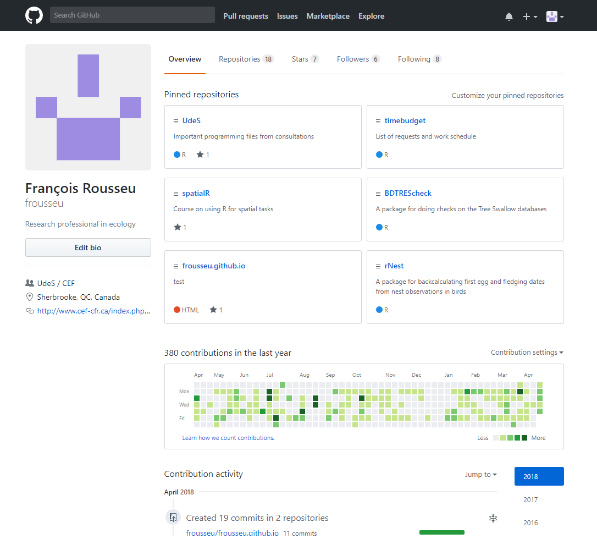
</div>

<hr>

## Configure Git

Once Git is installed and your GitHub account is created, you will have to configure Git with your username and your email. You will need to use the same info you provided in your GitHub account.

In the shell (or a terminal), type the following command to configure your credentials:

<pre style="background-color:black">
<span style="color:white; background-color:black">git config --global user.name "username"</span>
<span style="color:white; background-color:black">git config --global user.email "emailaddress"</span>
</pre>

To verify that everything was set up correctly, you can type:

<pre style="background-color:black">
<span style="color:white; background-color:black">git config --global --list</span>
</pre>

<hr>

## --- CHALLENGE 1 ---

Create your GitHub user account and configure Git!

<hr>

## Create a repository

The easiest way to [create a new repository](https://help.github.com/articles/create-a-repo/) is to create one on your online GitHub account. For this, you just have to go on the *Repositaries* tab and click the *New* button.

<div style="width:21.5cm">

</div>

<hr>

Here, you have to:

- choose a repository name
- give a small description of what it contains (this can be changed later)
- decide on wether it is public or private (but only public repositaries are possible with a free account)
- optionally check the box to include a *README.md* file to give more details on the content (recommended)

and create your first repository!

<hr>

<div style="width:21.5cm">

</div>

<hr>

## Basic operations

This is the content of the new repo **GHRSP**. Once you have this set up online, you want to copy the content and bring this on your local computer (*clone* it) so that you can modify it. To do this, you click on the *Clone or download* button and you copy the link given. This link will be used to synchronize the content with a local RStudio Git project.

<hr>

<div style="width:21.5cm">

</div>

<hr>

To do this, create a new *Version Control* RStudio project using Git.

<div style="width:5in">
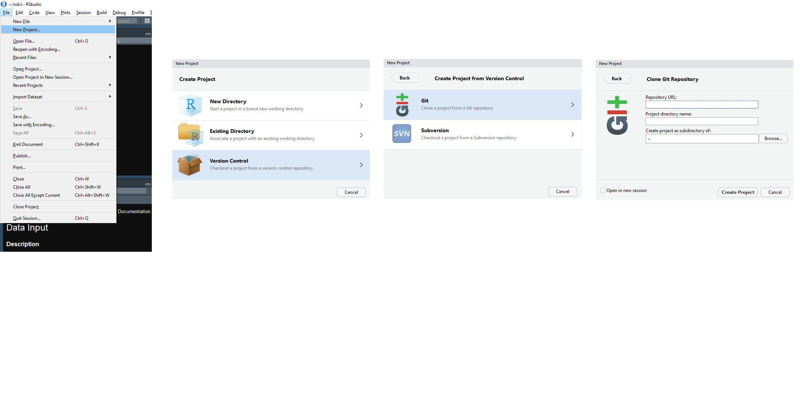
</div>

<hr>

Paste the link of the repo in the URL box and choose a directory for the project. The most logical name is the name of your repo. You can then create the project.

<div style="width:21.5cm">

</div>

<hr>

Once your project is created, RStudio will reopen with the project just created. You will notice that:

* there is a new *Git* tab in the Environment panel
* the working directory is set on the project folder
* files from the project can be opened from the *Files* tab
    + .gitignore (list of file names that should be ignored when detecting changes)
    + GHRSP.proj (project options)
    + README.md (description of the repo content)

<hr>

Text
<div style="width:21.5cm">

</div>

<hr>

### Commit

Now, suppose we want to modify the *README.md* file and add some information, we just have to add our modifications and then save the file. The file will appear in the Git tab with a blue box indicating that changes were detected. Changes were saved, but we may want to record these changes in the file history and **commit** these changes. A commit is sort of a snapshot of the file at a certain moment. To do this, we check the box and push the commit button.

<hr>

<div style="width:21.5cm">
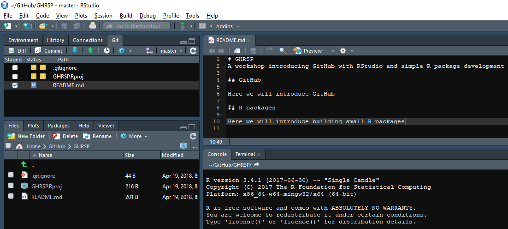
</div>

<hr>

This opens a window where we can see which files were commited and what changes have been made (the green area). To complete the commit, a commit message has to be given. The commit and the message are for every files that were checked.

<div style="width:21.5cm">

</div>

<hr>

Now, we may want to add a small correction to the README.md file. We just have to add our modification, **save it** and once again check the blue box indicating that changes were made. If, following changes, the blue box does not appear, it indicates that the file on which modifications were made was probably not saved. When committing these new changes, the red area shows what was deleted and the green area shows the new parts.

<div style="width:21.5cm">
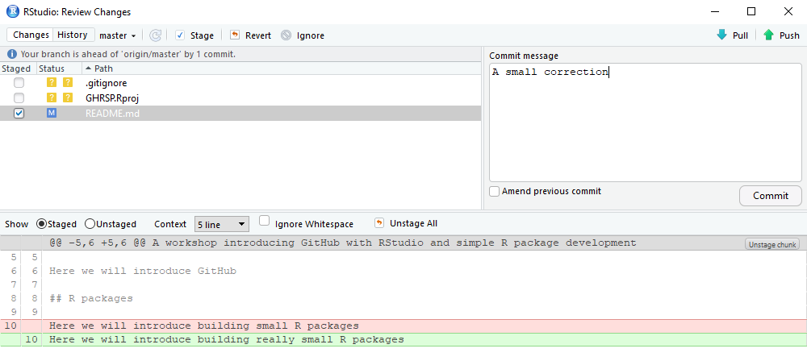
</div>

<hr>

### Push

Now that our *README.md* file has been commited twice, we have snapshots of the file at two different points. These commits are saved on your local computer, but they are not yet **pushed** on your online GitHub repo. To do this, we need to push the different commits to the repository. This can be done using the green arrow in the *Git* tab or in the commit window (so, just after a commit). This will update the online repo with the latest changes made to your local computer. 

<div style="width:21.5cm">

´</div>

<hr>

You can then go on your online repo to confirm that commits have been pushed online.

<div style="width:21.5cm">
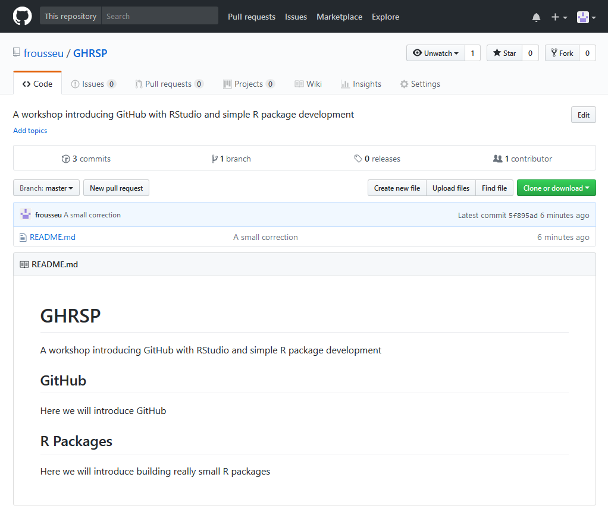
´</div>

<hr>

You can also check the history of commits (click the commit tab online) and confirm that two commits were made after the initial creation of the repo. The different commits can also be explored by clicking on them. You will see changes highlighted from the previous commit.

<div style="width:21.5cm">
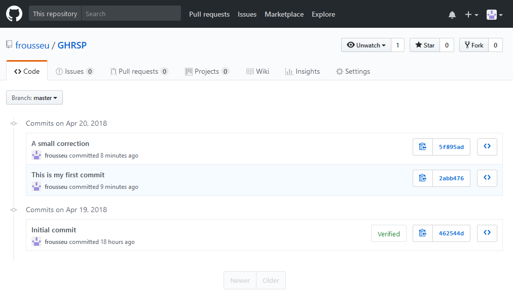
´</div>

<hr>

It is important to understand the difference between the commit and the push.

**Commit**: Saves a snapshot of a file at a specific timepoint 

**Push**: Pushes modifications and commits to the online GitHub repo

If you are partly using GitHub as a back up system for your programming files, pushing is essential because it is what is going to deposit your local files online. Several commits will only lead to having multiple snapshots of your files on your local computer.

<hr>

### Pull

**Pulling** is the reverse of pushing. It means updating your local repo with the online repositary. This can be useful (or even essential!) when:

- you made changes to the online repo through another computer
- someone else made changes to the online repo
- you made changes to the online repo directly through the web interface (uploading a file, modified an R or a markdown file, etc.)

<hr>

A *pull* can be done with the blue arrow right next to the green push arrow. If there are commits on the online repo that you don't have locally, you won't be able to push online until these changes have been included to your local repo through a pull. If you try pushing in such a case, an error message will be displayed that says that you first need to include these changes (or that the remote repo has work that you don't have locally).

If you are working from several computers, synchronizing early is important to reduce the likelihood of conflicts with different versions of the project. 

<hr>

## More advanced operations

RStudio only offers simple operations through their user interface. For more advanced operations, the shell and command lines may have to be used. For some common, but more advanced operations, the web interface can also be used. Here is a small overview of other common, but a bit more advanced operations.

<hr>

### Branching

Branches are used to have different versions of your work. This is useful with complex projects or when you start working on modifications that may break previous code or when development is still experimental. 

You can also use a branch when you want to develop something new, but keep the previous version available and functional until the new developments are integrated in your project.

Branches can also be used to host a project webpage.

<hr>

### Forking

You can also **fork** an existing repository from anybody else and include it in your local account. This is equivalent to copying the content of a repo and then creating a corresponding repo in your own account. This is useful if you want to:

- Use someone else's work and adapt it to your own work
- Propose changes (bug corrections, improvements, etc.) to someon else' work. In this case, you will have to issue a *pull request* to the other user who will have to accept or reject your proposed changes. 

<hr>

### Merging

Merging is done when you want to include somebody else proposed changes or when you want to merge two branches.

<hr>

Here are more possibilities when using the command line.

[GitHub Git Cheat Sheet](https://services.github.com/on-demand/downloads/github-git-cheat-sheet.pdf)

<hr>

### Issues

Issues are useful to record bugs, weird behaviours or suggested improvements. You can add issues to your own project or to someone else's project.

[Example](https://github.com/Leaflet/Leaflet/issues)

<hr>

## Other opportunities

### README

As said earlier, the *README.md* file is used to describe the content and the use of the repo. It can be used to document how to use the functions you are proposing or simply to include any information that is relevant.

The README.md file is a markdown (*.md*) and can also be used as a regular R markdown (*.Rmd*) file. Thus, you can include anything that you would include in a regular R markdown file.

<hr>

### github.io/project

Every repo comes with the possibility of adding a web page for the project. The material for the web page has to be stored in a special branch named **gh-pages**. The web page can be accessed at *username.github.io/project*.

### github.io

Every user account comes with a space for a web page that is not associated with a specific project, but with a specific repo named *username.github.io*. By default, this is the adress of the webpage. A repo with the content has to be created. This webpage can be customized as you like. 

[Create a personal GitHub page](https://pages.github.com/)

For a basic usage, you can include in the repo of your webpage an *index.html* file which will be displayed. Remember that html files can be generated with rmarkdown, which makes quite easy to create a simple interactive document that you could share with others.

<hr>

## --- CHALLENGE 2 ---

Create your first repository and commit and push your first changes!

<hr>

# R PACKAGES

This is an introduction to simple R package creation. We will briefly introduce simple R packages creation for the purpose of organizing your own work or important function or for facilitating the sharing of code within your study group. We won't go into the many details of package creation. We will only look at the basic structure required for building a package and how GitHub can facilitate the use of such personal or group packages. We will mostly rely on RStudio functionalities and the [devtools](https://github.com/r-lib/devtools) and [roxygen2](https://cran.r-project.org/web/packages/roxygen2/vignettes/roxygen2.html) packages to introduce how to build simple R packages. 

<hr>

Just as there are several reasons why you might want to use GitHub or a version control system, there are many reasons why you might want to organize certain important pieces of code in a package.

- Groups important functions in a common place instead of across scattered R files
- Forces you to document your functions and thus increase usability
- Facilitates the sharing of functions with others from your study group
- First step toward building an official package pusblished on CRAN

<hr>

For a complete description of the package creation process and of its requirements, visit the [Writing R Extensions](https://cran.r-project.org/doc/manuals/r-release/R-exts.html) manual which is the official and most complete source of information on R package creation.

Another thorough, but much more user-friendly resource is the [R packages](http://r-pkgs.had.co.nz/)(available online) book by Hadley Wickam. This is probably the best place to start for a more complete look at package creation (and even for using GitHub).

<hr>

## Development tools 

There are special tools needed for building R packages that contain compiled code such as C++ or when you want to build packages from source. In this tutorial, we probably won't need them, but it is good to have them if you plan to develop more complex packages or if you want to install packages directly from GitHub. The RStudio team provides a list of these tools depending on the platform. 

[Package Development Prerequisites](https://support.rstudio.com/hc/en-us/articles/200486498-Package-Development-Prerequisites)

<hr>

## Basic Structure

An R package has the basic structure:

- **DESCRIPTION**: metadata of the package (what the package does, dependencies, authors, licenses, etc.)
- **NAMESPACE**: in short, a file that indicates which elements of the package (functions, data) are available to the user
- **R/** directory: where functions are stored
- **man/** directory: where help files are stored

<hr>

### DESCRIPTION

This is the metadata of the package. Here is an example of what it can look like. Some fields are mandatory (*Package*, *Version*, *License*, *Description*, *Title*, *Author*, and *Maintainer*).

```{r, tidy=FALSE, eval=FALSE, highlight=FALSE }

Package: mypackage
Title: What The Package Does (one line, title case required)
Version: 0.1
Authors@R: person("First", "Last", email = "first.last@example.com",
                  role = c("aut", "cre"))
Description: What the package does (one paragraph)
Depends: R (>= 3.1.0)
License: What license is it under?
LazyData: true

```

<hr>

### NAMESPACE

The NAMESPACE is the file that lists what has to be exported from the package and available to the user and what should be imported from other packages. It is a really important file that prevents conflicts between the content of several packages. A more complete discussion of the NAMESPACE is way beyond the scope of this basic tutorial. Here, we will assume everything is exported and available to the user.

<hr>

### R/ directory

This is where functions are stored. If your package is not to complicated (no S3 or S4 methods), an .R file is used for each of your function.

<hr>

### man/ directory

This is where help files are stored. R help files are similar to LaTeX files and have the *.Rd* extension. With simple functions, there is usually an help file for each exported function. If a function is not exported through the NAMESPACE, it does not need to be documented in the help files. 

<hr>

## Creating a package

### The traditional way

The traditional way of creating packages is through functions such as `package.skeleton` or `prompt`. For example, let's use the first function. This function creates the necessary files and the infrastructure for a package. 

```{r, eval=FALSE}
package.skeleton("newpack")
```

<hr>

<div style="width:21.5cm">
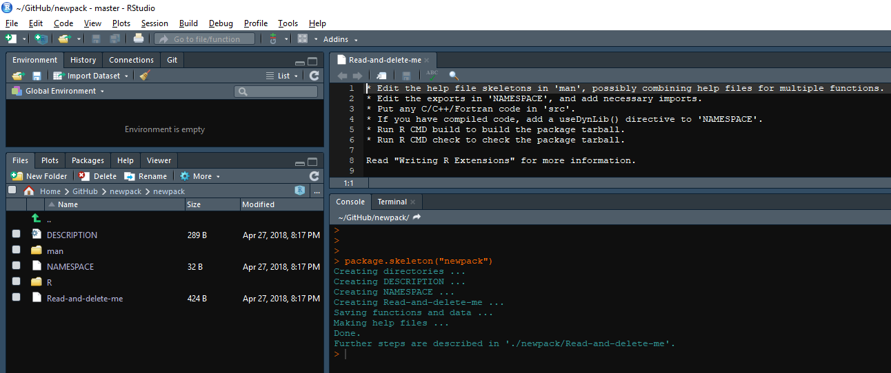
´</div>

<hr>

This creates a folder named *newpack* in which the package is stored. Each file now has to be edited to correspond to your package. Then Read-and-delete-me file can be deleted and files in the *R* and *man* folder can be replaced by your own functions.

<hr>

To do this, open a new R script and define a new function. Save this file with the same name as the function (here a file *f.R*) and make sure to put the file in the R folder of the package.
```{r, eval=TRUE}
f<-function(x,y){
	x+y
}

```

<hr>

Send `f` to the R console and apply the `prompt` function to your function `f`. This will create an help file (*f.Rd*) that you will have to edit to document your function. A message should tell you to edit to edit the file and to move it to the *man* folder. By default, `prompt` will create the *.Rd* file in the working directory (not necessarily in the package folder).
```{r, eval=TRUE}

prompt(f)

```

<hr>

<div style="width:21.5cm">

´</div>

<hr>

The *.Rd* file produced would now have to be edited to reflect what the `f` function does. One of the difficulty with this approach is that the function file and the help file for the function are separate. Thus, you need to remember to edit both files when important changes are made. 

<div style="width:21.5cm">
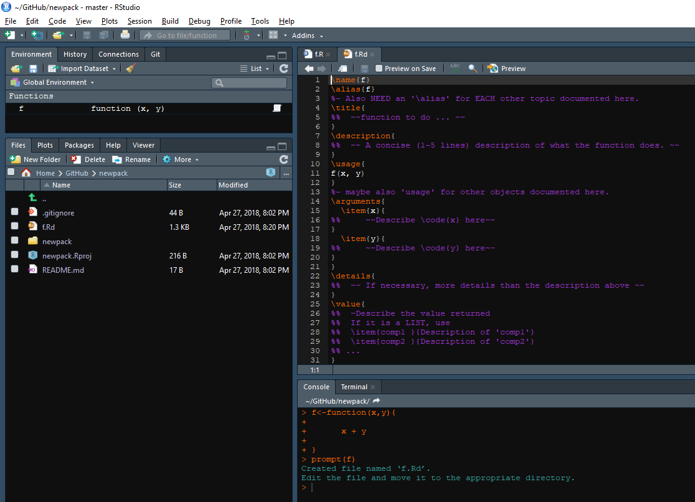
´</div>

<hr>

One option is to create the package through RStudio and then to link it to an online GitHub repository. This can be done doing *File > New Project > New Directory > R package*

<div style="width:21.5cm">
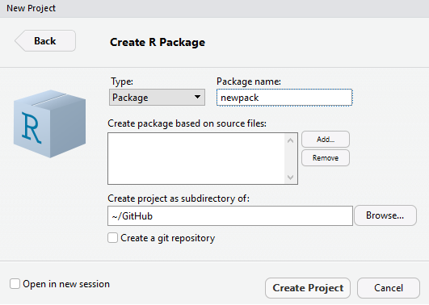
´</div>

<hr>


### The easier way

An easier way is to rely on the workflow provided by the packages [devtools](https://github.com/r-lib/devtools) and [roxygen2](https://cran.r-project.org/web/packages/roxygen2/vignettes/roxygen2.html). The first thing to notice with this workflow is that the help file and the function are combined on the same *.R* script.

Assuming you are into an RStudio projet that has the name of your package, you can use the function `setup` from package devtools to generate the package structure. You'll notice that the files created are simpler compared to the ones generated by `package.skeleton`.

Another and probably easier way is to first create a GitHub online repository and then to clone this repository using a version controled R Git project.

<hr>

The function `setup` assumes that the folder containing your package is already created (it it your RStudio project). If it is not, you can also use the function `create` which will also create this folder.

```{r}
library(devtools)
setup()
```

<hr>

Once again, you will have to edit the files according to your package. You can create an new R script that has a function in it, but this time, the help documentation will be written directly in the *f.R* script. 

You can do this by inserting a **Roxygen skeleton** at the beginning of the file. In the *f.R* file, put the cursor in the function and go to *Code > Insert Roxygen Skeleton*. Information will be added at the top of the file. 

Each line is preceded by `#'` which is the symbol for roxygen comments. This is where you are going to write the help file. The `@` symbol is used to associate each element with a section of the help file.

<hr>

<div style="width:21.5cm">
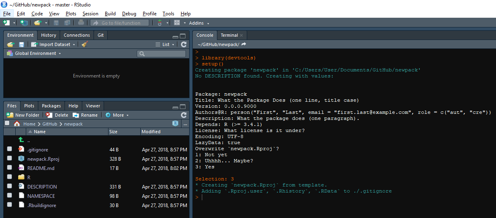
´</div>

<hr>

<div style="width:21.5cm">
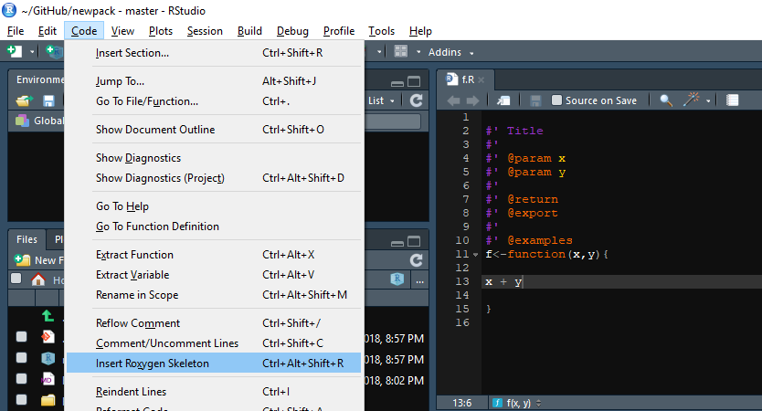
´</div>

<hr>

#### Tags

Tags (`@tag`) are what relates roxygen comments to the different sections in the help files. The first tags are optional. 


- `@title` Title of the function (tag optional)
- `@description` Description of (tag optional)
- `@param` Arguments of the function. They can be listed one after the other and the first and they are given in two parts (`@param name description`)
- `@return` This tells what the function returns
- `@export` This says to export the function and put it in the namespace
- `@examples` Give some useful examples
- `@seealso` This is where you can list related functions through links

<hr>

The first tags (`@title`, `@description`) are optional and it is recommanded to not use them. Instead, consider that:

1. The **first sentence** is the title of your function (or help page)
2. The **second paragraph** is the (usually brief) description
3. All **following paragraphs** before any tags will be put in the usual *Details* section.

<hr>

Once you edited the different elements, you can update the help files by simply using the `document` function.

```{r}
document() # This function updates the help files edited through roxygen comments
```

<hr>

<div style="width:21.5cm">
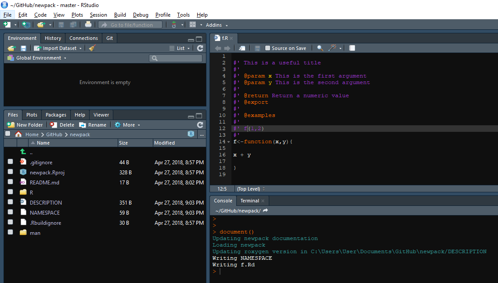
´</div>

<hr>

<div style="width:21.5cm">
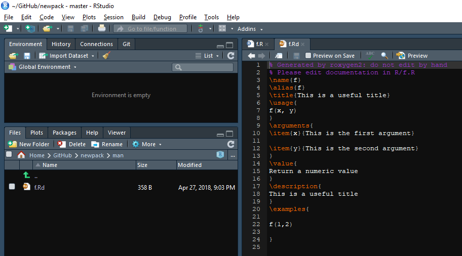
´</div>

<hr>

Once you updated the help files, you have several options to access your functions as if they were (almost) in a package. You can first use `load_all` which will simulate having the package installed. You can reload your package as many times as you like during development. Type `?function` to see the help file of your function and type the function name in the console to see its definition.

```{r}
load_all() # Loads a developing package almost as if it were a package loaded through library
```

<hr>

Another option is to use *Build > Clean and Rebuild* which will install and load the package (just like a real package).

<hr>

## Workflow

1. Create GitHub repo and clone it in an RStudio Git project
2. Use `devtools::setup` to create the structure
3. Document your help files through roxygen comments
4. Use `devtools::document` to update help files
5. Use `devtools::load_all` to study the output
6. *Clean and Rebuild* to install the package
7. Push you package to GitHub to make it available

[CheatSheet: Package development with devtools](https://ucsb-bren.github.io/env-info/refs/cheatsheets/devtools-cheatsheet.pdf)

<hr>

## Putting package on GitHub

To put your package on github, just commit and push everything just as a regular Git project. Once this is done, anybody can install your package using the `install_github` function from the devtools package.

```{r, eval=FALSE}
install_github("frousseu/FRutils")
```

<hr>

## --- CHALLENGE 3 ---

Create your own package and put it on GitHub. Install it using `install_github`.

<hr>

# LINKS

<!-- [A Quickstart Guide for Building Your First R Package](https://methodsblog.wordpress.com/2015/11/30/building-your-first-r-package/): A short introduction. -->

[Writing R Extensions](): The official documentation on writing R packages. 

[R Packages](http://r-pkgs.had.co.nz/): A book (online) on package development by Hadley Wickham 

[Easy websites with GitHub pages](http://kbroman.org/simple_site/): A tutorial on creating a webpage associated with a GitHub project

[The Git Workflow](https://www.git-tower.com/blog/workflow-of-git)

[GitHub Git Cheat Sheet](https://services.github.com/on-demand/downloads/github-git-cheat-sheet.pdf)

[CheatSheet: Package development with devtools](https://ucsb-bren.github.io/env-info/refs/cheatsheets/devtools-cheatsheet.pdf)

[STAT 545](http://stat545.com/topics.html): Good resource on related subjects